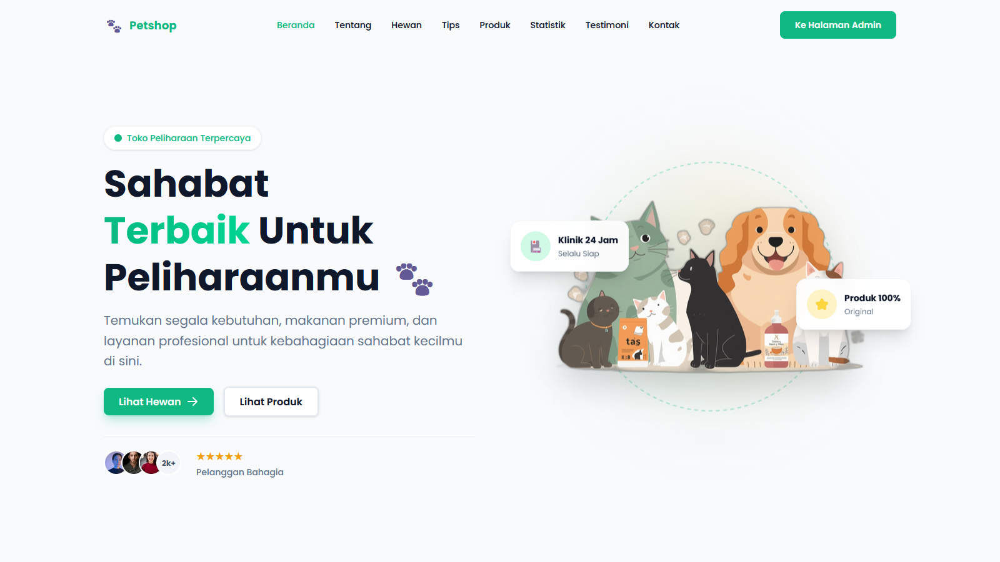
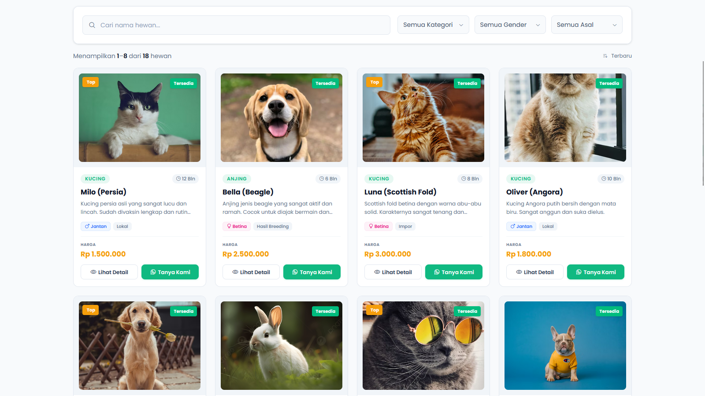
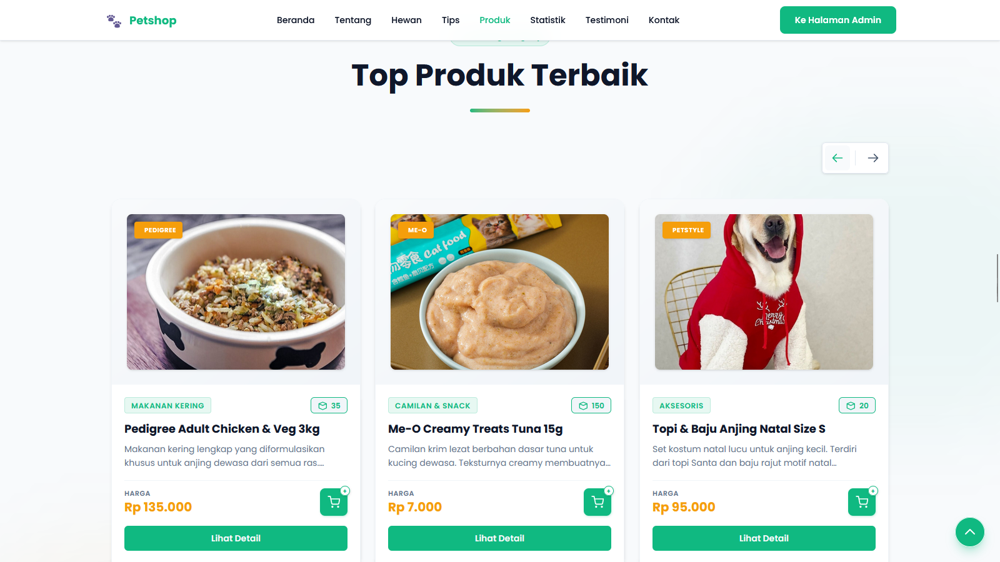
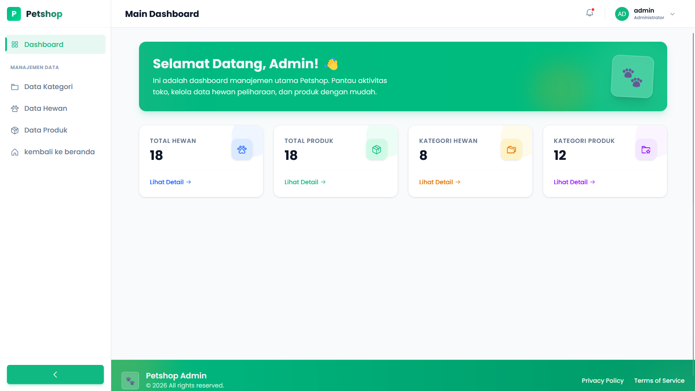

  

  
  
  

# 🐾 Sistem Manajemen Petshop

Aplikasi web modern dan komprehensif untuk mengelola petshop, dilengkapi dengan pemfilteran data dinamis, katalog untuk pelanggan, dan dashboard admin yang powerful.

---

## ✨ Fitur-fitur

- **Halaman Utama Dinamis (Landing Page)**: Halaman beranda yang menarik secara visual untuk menampilkan produk dan hewan peliharaan terbaik.
- **Pencarian & Pemfilteran**: Pencarian dan pemfilteran langsung (real-time) untuk hewan (berdasarkan kategori, asal, jenis kelamin) dan produk.
- **Halaman Detail**: Tampilan detail yang komprehensif untuk setiap hewan dan produk dengan galeri gambar dan spesifikasinya.
- **Dashboard Admin**: Backoffice yang aman untuk mengelola konten.
- **Operasi CRUD**: Kemampuan penuh untuk Membuat (Create), Membaca (Read), Memperbarui (Update), dan Menghapus (Delete) data:
  - Hewan
  - Produk
  - Kategori
  - Galeri Gambar
- **Desain Responsif**: Dioptimalkan untuk berbagai ukuran layar untuk memastikan pengalaman pengguna yang mulus.

---

## 🛠️ Tech Stack

Dibuat dengan teknologi yang kuat dan modern untuk memastikan performa, skalabilitas, dan pengalaman pengembangan yang menyenangkan.

* **Backend & Framework**: [Laravel 11](https://laravel.com/)
* **Frontend**: [Blade](https://laravel.com/docs/blade) & [Alpine.js](https://alpinejs.dev/)
* **Styling**: [Tailwind CSS](https://tailwindcss.com/)
* **Database**: [MySQL](https://www.mysql.com/)
